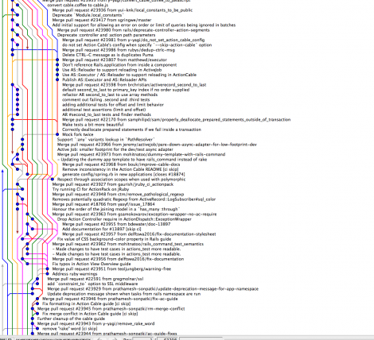
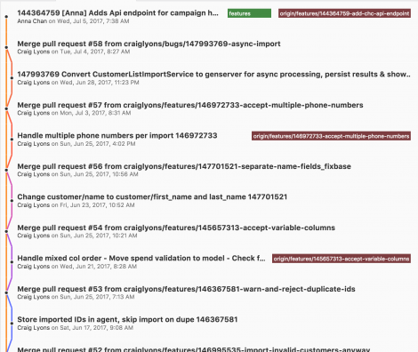

# Git Notes[^1]

## ToDo
 - Overthink the workflow for `master` `dev`  `feature-branch` `hotfix-branch` model.
 - Look at [git-flow](https://github.com/nvie/gitflow)

## Links
 - https://nvie.com/posts/a-successful-git-branching-model
 - https://blog.carbonfive.com/2017/08/28/always-squash-and-rebase-your-git-commits
 - https://spin.atomicobject.com/2017/04/23/maintain-clean-git-history
 - https://spin.atomicobject.com/2017/10/23/github-releases


## Workflow

### Summary

#### Shortend workflow
```
# On a work branch after you have made granular commits
git rebase -i <earliest_commit-like_that's_not_included>
git push origin my_working_branch
git checkout master
git merge my_working_branch
git push origin master
```
This is unsafe and works only, if no other people have made changes to `master` or `my_working_branch` and everything is up do date. If youre not absolutely sure of these facts use the...

#### Detailed workflow
```
# State of affairs:
git pull origin master
git checkout -b my_working_branch
# ...now, make your changes in as many commits as you like...

# Actual rebase
git rebase -i <earliest_commit-like_that's_not_included>

# Make sure your branch is up to date
git pull --rebase                   # if other people made changes to your working branch

# Pus to remote working branch
git push origin my_working_branch   #--force if you already pushed some of the commits in the rebase

# Make sure master is up to date
git checkout master
git pull origin master

# Merge branch into master
git checkout my_working_branch
git merge my_working_branch #--squash
git push origin master

# (Optionally) delete working branch
git push -d origin my_working_branch
git branch -d my_working_branch
```

#### Diagrams

[^2]

 [^2]

### 0. Make sure to be on your working branch

This step is just preparations and you making your actual changes in the source.
```
git pull origin master
git checkout -b my_working_branch

# ...now, make your changes in as many commits as you like...
```
Once done, the rebase blizzard commences.

### 1. Perform rebase on working branch

```
git rebase -i <commit-like>

# commit-like one before the first that should be included in rebase
```

Here, `<commit-like>` can  e.g. a be a SHA hash or something like `HEAD~5`, i.e. five commits back from head. Make it refer to the one **before** the actual first commit that you want to include in the rebase. Look at the output of something like `git log --graph --decorate --pretty=oneline --abbrev-commit`.

Here is an example:


```
$ git lg   # before the rebase
* fed57ba - (HEAD -> dev, origin/dev) So many typos to squash (19 minutes ago) <Jan Christoph Bischko>
* e79a80f - Thou shalt not compare little Jons (20 minutes ago) <Jan Christoph Bischko>
* ffbc280 - I keep making silly mistakes so I can sqaush later (21 minutes ago) <Jan Christoph Bischko>
* 461ffeb - Oh noes, another typo (21 minutes ago) <Jan Christoph Bischko>
* 9b5b316 - Answer Lil Jon, yay-yah! (22 minutes ago) <Jan Christoph Bischko>
* 4573e90 - Correct another totally intentional typo (23 minutes ago) <Jan Christoph Bischko>
* ca80d3a - Correct totally intentional type (25 minutes ago) <Jan Christoph Bischko>
* 8a56b9c - hello cruel world (26 minutes ago) <Jan Christoph Bischko>
* a67e0fe - Prettify README.md (40 minutes ago) <Jan Christoph Bischko>
* 9b771c3 - (origin/master, origin/HEAD, master) Initial commit (49 minutes ago) <con-f-use>

$ git rebase -i 8a56b9c
```

```
git lg     # after rebase
* 30266a4 - (HEAD -> dev) Answer Lil John, yay-yah! (5 minutes ago) <Jan Christoph Bischko>
* 8a56b9c - hello cruel world (32 minutes ago) <Jan Christoph Bischko>
* a67e0fe - Prettify README.md (46 minutes ago) <Jan Christoph Bischko>
* 9b771c3 - (origin/master, origin/HEAD, master) Initial commit (55 minutes ago) <con-f-use>

```


### 2. Push your changes to remote working branch

If others might have made changes to your local working branch, pull them:
```
git pull --rebase
```
Review them and determine if you might need to do additional rebases.

```
git push origin my_working_branch #--force
```
If you have previously pushed your code to a remote branch, you will need to force push. The `origin my_working_branch` is not necessary, if `my_working_branch` exists on the remote.


### 3. Pull changes from master into remote working branch

Make sure your master it up to date:
```
git checkout master
git pull origin master
git checkout my_working_branch
```
Do the actual rebase
```
git rebase master
git push origin my_working_branch --force
```

### 4. Merge changes into remote master
```
git checkout master
git merge my_working_branch #--squash
git push origin master
```
`--squash` will roll all commits into a single one before merging. It’s nice because the single commit message will contain all of the other commit messages.


### 4a. (Optionally) Delete the working branch

Keeping branches around longer than necessary creates confusion and the necessity for awkward branch names if your favorite is taken.  On the other hand, it's sometimes easier to track changes when the branch still exists.


[^1]: If I use strange git commands like `git lg`, `git st` or `git fza` have a look at my [aliases](https://github.com/con-f-use/yadmdotfiles/blob/master/.config/yadmdotfiles/git/gitconfig#L20)

[^2]: For sources see the ["Links" section](#links)
